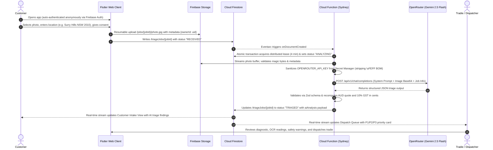

# TradieFlow AI

[](https://tradieflow-ai.web.app)
[](https://www.exodigital.com.au/)
[](https://flutter.dev)
[-4285F4?style=for-the-badge&logo=googlecloud)](https://cloud.google.com/functions)
[](https://openrouter.ai)

**TradieFlow AI** is a real-time, photo-led trade triage and dispatch platform designed for Australian trade contractors (HVAC, plumbing, electrical, and appliance repair), engineered by [Exo Digital](https://www.exodigital.com.au/). It transforms unstructured customer photo submissions into structured, actionable trade diagnostic records—featuring automated OCR model plate recognition, hazard identification, Australian Standards (AS/NZS 3000 & 3500) safety guidance, and itemized AUD quotes with exact GST calculations.

🌐 **Production Application:** [https://tradieflow-ai.web.app](https://tradieflow-ai.web.app)  
🏢 **Engineered By:** [Exo Digital](https://www.exodigital.com.au/)  
📦 **Firebase Project ID:** `tradieflow-ai`  
📍 **Primary Cloud Region:** `australia-southeast1` (Sydney, Australia)

---

## 📑 Table of Contents
1. [Architecture Overview](#-architecture-overview)
2. [End-to-End System Flow](#-end-to-end-system-flow)
3. [AI Triage & Multimodal Vision Engine](#-ai-triage--multimodal-vision-engine)
4. [Multi-Layer Cache Elimination Strategy](#-multi-layer-cache-elimination-strategy)
5. [Security, Secret Management & Public Safety](#-security-secret-management--public-safety)
6. [Design System: Glassline](#-design-system-glassline)
7. [Repository Structure](#-repository-structure)
8. [Local Development & Emulators](#-local-development--emulators)
9. [Automated Testing Suite](#-automated-testing-suite)
10. [Production Deployment](#-production-deployment)

---

## 🏛 Architecture Overview

TradieFlow AI employs a reactive, serverless event-driven architecture designed for zero client friction and enterprise-grade security:

```
┌─────────────────────────────────────────────────────────────────────────────┐
│                             CLIENT LAYER                                    │
│  Flutter 3.38.5 Web PWA (Glassline Design System · Geist Typography)        │
│                                                                             │
│   [Customer Intake View]                     [Tradie Dispatch Dashboard]    │
│   - Anonymous Auth (zero friction)           - Role-Claimed Auth (Dispatcher)│
│   - Resumable Photo Upload (metadata-bound)  - Real-time Firestore Stream    │
│   - Australian Suburb/Postcode Validation    - Urgency Filter & Diagnostics │
└───────────────────────┬─────────────────────────────────▲───────────────────┘
                        │ 1. Resumable Upload             │ 7. Real-time Listen
                        ▼    (/jobs/{jobId}/photo.jpg)     │    (StreamBuilder)
┌───────────────────────────────────┐                     │
│         FIREBASE STORAGE          │                     │
│  gs://tradieflow-ai.firebasestorage.app                 │
│  - Owner-tagged metadata          │                     │
│  - Strict CEL storage.rules       │                     │
└───────────────────────┬───────────┘                     │
                        │ 2. Create Job Doc               │
                        ▼ (status: "RECEIVED")            │
┌─────────────────────────────────────────────────────────┴───────────────────┐
│                           CLOUD FIRESTORE                                   │
│  Collection: /triageJobs/{jobId}                                            │
│  - Strict field validation & ownership checks via firestore.rules           │
│  - Compound indexes on ownerId & createdAt                                  │
│  - Status lifecycle: RECEIVED -> ANALYZING -> TRIAGED / TRIAGE_FAILED       │
└───────────────────────┬─────────────────────────────────────────────────────┘
                        │ 3. onDocumentCreated Trigger (Eventarc)
                        ▼
┌─────────────────────────────────────────────────────────────────────────────┐
│                CLOUD FUNCTIONS 2ND GEN (australia-southeast1)               │
│  Function: processJobTriage · Node.js 22 · Memory: 512MiB · Timeout: 180s  │
│                                                                             │
│  1. Distributed Lease Claim & Transactional Attempt Increment               │
│  2. Stream Storage Buffer & Magic-Byte Signature Validation (JPEG/PNG/WebP) │
│  3. Secret Sanitization: BOM Stripping (\uFEFF) & IAM Access                │
│  4. Multimodal Analysis via OpenRouter API (Base URL: openrouter.ai/api/v1) │
│     - Model: google/gemini-2.5-flash                                        │
│     - Zero-shot OCR compliance plate recognition & model extraction         │
│     - Threat & hazard verification (AS/NZS 3000 electrical & 3500 plumbing) │
│     - Itemized AUD cost breakdown (labor, callout, parts, dynamic parts)    │
│  5. Zod Schema Verification & Server-side Currency/GST Recomputation (10%) │
│  6. Atomic Write: Status updated to "TRIAGED" (or "TRIAGE_FAILED")          │
└───────────────────────┬─────────────────────────────────────────────────────┘
                        │
                        ▼
┌───────────────────────────────────┐
│      GOOGLE SECRET MANAGER        │
│  Secret: OPENROUTER_API_KEY       │
│  - Least-privilege IAM binding    │
│  - In-flight BOM sanitization     │
└───────────────────────────────────┘
```

---

## 🔄 End-to-End System Flow



### State Machine Lifecycle
```
                 ┌──────────────┐
                 │   RECEIVED   │ (Created by customer client)
                 └──────┬───────┘
                        │ Function claim transaction
                        ▼
                 ┌──────────────┐
                 │  ANALYZING   │ (Distributed lease active, attempt <= 3)
                 └──────┬───────┘
           ┌────────────┴────────────┐
           │ Success                 │ API / Validation failure
           ▼                         ▼
    ┌──────────────┐          ┌──────────────┐
    │   TRIAGED    │          │ TRIAGE_FAILED│ (Safe fallback error,
    └──────────────┘          └──────────────┘  never fabricates diagnosis)
```

---

## 🧠 AI Triage & Multimodal Vision Engine

### Model Selection
The backend leverages **`google/gemini-2.5-flash`** via OpenRouter (`https://openrouter.ai/api/v1`), providing:
- High-speed multimodal visual processing (typically 2–3s round-trip).
- High visual fidelity for blurred, angled, weathered, or rusted appliance rating plates.
- Native adherence to strict JSON Schema output contracts.

### Prompt Hardening & Untrusted Input Isolation
- All customer-supplied fields, filenames, and image contents are treated as **untrusted data**, never instructions.
- The system prompt strictly enforces:
  1. Advisory-only status (no certified statutory findings).
  2. AS/NZS 3000 (wiring) and AS/NZS 3500 (plumbing) safety compliance warnings.
  3. No invasive testing or DIY repair instructions given to customers (recommends licensed tradie or 000 for danger).
  4. Brand/Model OCR fallback: reports `Unknown` if missing, `Unreadable` if obscured, rather than guessing model numbers.
  5. Currency calculation: base line items exclude GST; server recomputes 10% GST and totals in integer cents.

### Zod Normalization Schema
```typescript
{
  urgency: "P1_EMERGENCY" | "P2_SAME_DAY" | "P3_ROUTINE",
  urgencyReasoning: string,
  hazardIdentified: boolean,
  immediateSafetyAction: string,
  appliance: {
    brand: string,
    modelNumber: string,
    type: string,
    estimatedAgeBracket: string
  },
  faultDiagnostic: string,
  recommendedParts: string[],
  estimatedLaborHours: number,
  quoteAud: {
    calloutFee: number,
    laborCost: number,
    partsCost: number,
    gst: number,
    totalEstimate: number
  },
  dynamicClarification: string
}
```

---

## ⚡ Multi-Layer Cache Elimination Strategy

To eliminate persistent browser cache traps (where Chrome/Edge continue serving stale JavaScript bundles or assets even after deployment), TradieFlow AI implements a three-layer cache invalidation architecture:

1. **HTTP `Clear-Site-Data: "cache"` Header in [firebase.json](file:///c:/Users/Adit%20Victus/Desktop/Larp/TradieFlow-AI/firebase.json):**
   ```json
   {
     "source": "/{,index.html,version.json}",
     "headers": [
       { "key": "Cache-Control", "value": "no-cache, no-store, must-revalidate" },
       { "key": "Clear-Site-Data", "value": "\"cache\"" }
     ]
   }
   ```
   Instructs modern browsers to immediately wipe their origin network disk cache upon requesting `index.html` or `version.json`.

2. **Active CacheStorage & Service Worker Purge in [web/index.html](file:///c:/Users/Adit%20Victus/Desktop/Larp/TradieFlow-AI/web/index.html):**
   ```javascript
   // Unconditionally clear window.caches and unregister service workers on every visit
   if ('serviceWorker' in navigator) {
     navigator.serviceWorker.getRegistrations().then((registrations) => {
       for (const registration of registrations) registration.unregister();
     }).catch(() => {});
   }
   if ('caches' in window) {
     caches.keys().then((keys) => {
       for (const key of keys) caches.delete(key);
     }).catch(() => {});
   }
   ```
   Ensures that old Flutter service workers (`flutter_service_worker.js`) cannot retain stale application bundles.

3. **Asset Versioning (`_v2`):**
   Static brand assets are version-tagged (e.g. `ExoLogo_web_v2.png`). Because the URI path changes with each release, browsers bypass any existing local asset cache.

---

## 🔒 Security, Secret Management & Public Safety

This repository is designed from the ground up to be safe for public source code hosting:

1. **Zero Secret Leakage:**
   - No API keys, credentials, or private keys exist in version control.
   - Secret manager environment files (`.env*`, `.secret*`) are excluded via `.gitignore`.
2. **BOM-Resistant Secret Management:**
   - In [functions/src/triage.ts](file:///c:/Users/Adit%20Victus/Desktop/Larp/TradieFlow-AI/functions/src/triage.ts), API keys loaded from Secret Manager are automatically sanitized (`replace(/^\uFEFF/, "").trim()`) to prevent Node.js 22 `undici`/`fetch` byte-string encoding crashes caused by Windows UTF-8 Byte Order Marks.
3. **Firestore Security Rules (RBAC):**
   - Customers can only read and create their own job documents (`resource.data.ownerId == request.auth.uid`).
   - Dispatchers must possess an authenticated token with custom claim `dispatcher: true`.
   - Postcode-to-state cross-validation for Australian jurisdictions (NSW, VIC, QLD, SA, WA, TAS, NT, ACT) is enforced directly inside Firestore CEL rules.
   - Client updates and deletes are disabled (`allow update, delete: if false`).
4. **Storage Rules & Resumable Upload Integrity:**
   - Photos must be placed in `/jobs/{jobId}/photo.jpg` with a maximum size of 5 MiB.
   - Supported MIME types strictly enforced (`image/jpeg`, `image/png`, `image/webp`).
   - Server-side validation inspects binary magic bytes before passing image data to the AI model.
5. **CORS Hardening:**
   - Cloud Storage CORS is strictly restricted to production domains (`https://tradieflow-ai.web.app`, `https://tradieflow-ai.firebaseapp.com`) and local emulator ports.

---

## 🎨 Design System: Glassline

TradieFlow AI uses the **Glassline** design system—a high-contrast, minimalist visual language tailored for trade workflows:

- **Foundation Canvas:** `#F1F3F5` (Fog Grey)
- **Primary Elements & Typography:** `#0F1419` (Near Black)
- **Secondary Accents:** `#4A5568` (Muted Slate)
- **Interaction Driver:** `#2C5EF5` (Precision Cobalt)
- **Surface Elevation:** `#FFFFFF` (Solid Card Surface with 1px border)
- **Typography:** Offline-bundled `Geist` and `Geist Mono`.

---

## 📁 Repository Structure

```
TradieFlow-AI/
├── .firebaserc                # Active Firebase project configuration ("tradieflow-ai")
├── firebase.json              # Hosting, Functions, Firestore, Storage, and Emulator configs
├── firestore.indexes.json     # Compound indexes for collection group queries
├── firestore.rules            # CEL security rules for Cloud Firestore
├── storage.cors.json          # Production CORS policy for Firebase Storage
├── storage.rules              # CEL security rules for Firebase Storage
├── pubspec.yaml               # Flutter package configuration and versioned assets
├── README.md                  # Complete technical architecture, flows, and operations guide
│
├── functions/                 # Backend Cloud Functions (2nd Gen, Node.js 22)
│   ├── src/
│   │   ├── index.ts           # Eventarc Firestore onDocumentCreated entrypoint & model configuration
│   │   ├── schemas.ts         # Zod schemas, image validation & Australian state/postcode rules
│   │   └── triage.ts          # Distributed lease, OpenRouter AI client, OCR logic & GST calculations
│   ├── test/
│   │   ├── backend.test.cjs   # 9 unit tests (schema bounds, injection defense, BOM sanitization)
│   │   └── rules.test.cjs     # Emulator security rules integration test suite
│   ├── tsconfig.json          # TypeScript compilation settings
│   └── package.json           # Backend dependencies and build scripts
│
├── lib/                       # Flutter Web Client (3.38.5)
│   ├── firebase_options.dart  # Production Firebase platform configuration
│   ├── main.dart              # App shell, 3-tab navigation (Home, Triage, Dispatch) & state
│   ├── services/
│   │   └── job_service.dart   # Firebase Auth, Firestore streams, and resumable Storage uploads
│   ├── theme/
│   │   ├── glassline_tokens.dart # Color tokens, spacing, and border radii
│   │   └── glassline_theme.dart  # Material 3 theme configuration
│   ├── views/
│   │   ├── landing_page_view.dart    # Product overview, 3-step process, sample triage card
│   │   ├── customer_intake_view.dart # Photo upload, camera capture, location inputs & live stream
│   │   └── tradie_dispatch_view.dart # Real-time triage queue, search, and urgency filtering
│   └── widgets/
│       └── job_card.dart      # Expandable triage card with urgency badge & itemized quote
│
├── test/
│   └── widget_test.dart       # 7 Flutter widget tests (responsive layout, navigation, auth states)
│
└── web/                       # Progressive Web App assets
    ├── index.html             # Shell with cache purge, offline indicator & first-frame loader
    ├── manifest.json          # Web app manifest
    └── shell.test.cjs         # Node test suite validating web shell and manifest
```

---

## 💻 Local Development & Emulators

### Prerequisites
- [Flutter SDK](https://docs.flutter.dev/) `^3.38.5`
- [Node.js](https://nodejs.org/) `^22.0.0`
- [Firebase CLI](https://firebase.google.com/docs/cli) `^15.0.0` (`npm install -g firebase-tools`)

### 1. Running with Firebase Local Emulators
Start the local emulators (Firestore `8080`, Storage `9199`, Functions `5001`, Auth `9099`, UI `4000`):
```bash
firebase emulators:start
```

### 2. Launching the Flutter Web Application
Run Flutter targeting the local emulators:
```bash
flutter run -d chrome --dart-define=USE_FIREBASE_EMULATORS=true
```

---

## 🧪 Automated Testing Suite

The repository contains a full automated testing pyramid:

```bash
# 1. Run Flutter Widget, Navigation, and Location Validation Tests (7 tests)
flutter test

# 2. Run Backend Schemas, BOM Sanitization, and Prompt Hardening Tests (9 tests)
npm --prefix functions test

# 3. Run Web Shell & Manifest Validation Tests
node --test web/shell.test.cjs
```

---

## 🚀 Production Deployment

```bash
# 1. Select the active project
firebase use tradieflow-ai

# 2. Deploy Firestore Security Rules & Compound Indexes
firebase deploy --only firestore

# 3. Deploy Storage Security Rules
firebase deploy --only storage

# 4. Deploy Cloud Functions (Node.js 22 in australia-southeast1)
firebase deploy --only functions

# 5. Build Flutter Web Release & Deploy to Firebase Hosting
flutter build web --release
firebase deploy --only hosting
```

---

## 📄 License
This project is licensed under the [MIT License](LICENSE). Engineered by [Exo Digital](https://www.exodigital.com.au/).
