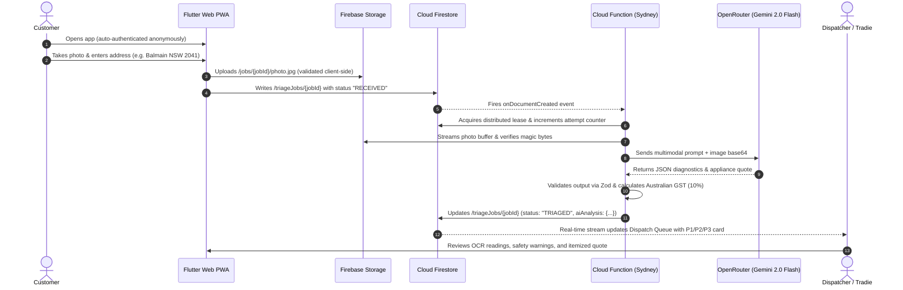

# TradieFlow AI

[](https://tradieflow-ai.web.app)
[](https://www.exodigital.com.au/)
[](https://flutter.dev)
[-4285F4?style=for-the-badge&logo=googlecloud)](https://cloud.google.com/functions)
[](https://openrouter.ai)

**TradieFlow AI** is a real-time, photo-led trade triage and dispatch platform designed for Australian trades (HVAC, plumbing, electrical, and appliance repair), engineered by [Exo Digital](https://www.exodigital.com.au/). It transforms unstructured customer photo submissions into structured, actionable trade diagnostic records—featuring automated OCR model plate recognition, hazard identification, Australian Standards (AS/NZS) safety guidance, and itemized AUD quotes.

🌐 **Production Application:** [https://tradieflow-ai.web.app](https://tradieflow-ai.web.app)  
🏢 **Engineered By:** [Exo Digital](https://www.exodigital.com.au/)  
📦 **Firebase Project ID:** `tradieflow-ai`

---

## 📑 Table of Contents
1. [Architecture Overview](#-architecture-overview)
2. [End-to-End System Flow](#-end-to-end-system-flow)
3. [Design System: Glassline](#-design-system-glassline)
4. [Security & Public Repo Safety](#-security--public-repo-safety)
5. [Repository Structure](#-repository-structure)
6. [Local Development & Emulators](#-local-development--emulators)
7. [Automated Testing Suite](#-automated-testing-suite)
8. [Production Deployment](#-production-deployment)

---

## 🏛 Architecture Overview

TradieFlow AI employs a reactive, serverless event-driven architecture designed for zero client friction and high security:

```
┌─────────────────────────────────────────────────────────────────────────────┐
│                             CLIENT LAYER                                    │
│  Flutter 3.38.5 Web PWA (Glassline Design System · Geist Typography)        │
│                                                                             │
│   [Customer Intake View]                     [Tradie Dispatch Dashboard]    │
│   - Anonymous Auth                           - Role-Claimed Auth (Dispatcher)│
│   - Camera / Photo Upload                    - Real-time Firestore Stream    │
│   - Australian Suburb/Postcode Validation    - Urgency Filter & Diagnostics │
└───────────────────────┬─────────────────────────────────▲───────────────────┘
                        │ 1. Upload Photo                 │ 6. Real-time Listen
                        ▼                                 │    (StreamBuilder)
┌───────────────────────────────────┐                     │
│         FIREBASE STORAGE          │                     │
│  gs://tradieflow-ai.firebasestorage.app                 │
│  Path: /jobs/{jobId}/photo.jpg    │                     │
└───────────────────────┬───────────┘                     │
                        │ 2. Create Job Doc               │
                        ▼ (status: "RECEIVED")            │
┌─────────────────────────────────────────────────────────┴───────────────────┐
│                           CLOUD FIRESTORE                                   │
│  Collection: /triageJobs/{jobId}                                            │
│  - Strict field validation & ownership checks via firestore.rules           │
│  - Compound indexes on ownerId & createdAt                                  │
└───────────────────────┬─────────────────────────────────────────────────────┘
                        │ 3. onDocumentCreated Trigger
                        ▼
┌─────────────────────────────────────────────────────────────────────────────┐
│                CLOUD FUNCTIONS 2ND GEN (australia-southeast1)               │
│  Function: processJobTriage · Node.js 22 · Memory: 512MiB · Timeout: 180s  │
│                                                                             │
│  1. Distributed Lease Claim & Idempotency Transaction                       │
│  2. Download & Magic-Byte Signature Validation (JPEG, PNG, WebP <= 5MiB)    │
│  3. Multimodal Analysis via OpenRouter API (Base URL: openrouter.ai/api/v1) │
│     - Model: google/gemini-2.0-flash-001                                    │
│     - Zero-shot OCR appliance identification & serial parsing               │
│     - Threat and hazard detection (AS/NZS compliance)                       │
│  4. Zod Schema Verification & AUD Financial Recomputation (ex/inc GST)      │
│  5. Atomic Write: Status updated to "TRIAGED" (or "TRIAGE_FAILED")          │
└───────────────────────┬─────────────────────────────────────────────────────┘
                        │
                        ▼
┌───────────────────────────────────┐
│      FIREBASE SECRET MANAGER      │
│  Secret: OPENROUTER_API_KEY       │
│  - Least-privilege IAM binding    │
└───────────────────────────────────┘
```

---

## 🔄 End-to-End System Flow



---

## 🎨 Design System: Glassline

TradieFlow AI uses the **Glassline** design system—a minimal, professional visual aesthetic built specifically for trade workflows where rapid clarity and high contrast are paramount:

- **Neutral Foundation Canvas:** `#F1F3F5` (Fog Grey)
- **Primary Typography & High-Contrast Elements:** `#0F1419` (Near Black)
- **Secondary Borders & Labels:** `#4A5568` (Muted Slate)
- **Sole Cobalt Interaction Driver:** `#2C5EF5` (Precision Cobalt)
- **Surfaces:** `#FFFFFF` (Solid Card Surface)
- **Typography:** Custom offline-bundled `Geist` (primary text) and `Geist Mono` (code, postcodes, technical specs).

---

## 🔒 Security & Public Repo Safety

This repository is strictly configured to be **safe for public release**:

1. **Zero Secret Leakage:**
   - No API keys, service accounts, or private credentials are committed to version control.
   - Sensitive environment files (`.env*`, `.secret*`, `firebase-config.json`) are enforced in `.gitignore`.
2. **Server-Side Secret Management:**
   - The `OPENROUTER_API_KEY` is provisioned exclusively in **Firebase Secret Manager** (`projects/397848547468/secrets/OPENROUTER_API_KEY`).
   - Access is restricted with least-privilege IAM roles to the Cloud Functions execution service account.
3. **Firestore Security Rules:**
   - Role-Based Access Control (RBAC): Unauthenticated access is rejected.
   - Customers can only read and create their own jobs (`resource.data.ownerId == request.auth.uid`).
   - Only users with the verified custom token claim `dispatcher: true` can query across jobs.
   - Jobs are strictly immutable by clients after creation (`allow update, delete: if false`).
   - Australian postcode-to-state cross-validation is enforced directly in CEL rules.
4. **Storage Security Rules & CORS:**
   - Path-restricted uploads (`/jobs/{jobId}/photo.jpg`) limited to 5MB.
   - Supported MIME types strictly enforced (`image/jpeg`, `image/png`, `image/webp`).
   - CORS policy explicitly limits cross-origin requests to authorized production domains (`https://tradieflow-ai.web.app`, `https://tradieflow-ai.firebaseapp.com`) and local development ports.

---

## 📁 Repository Structure

```
TradieFlow-AI/
├── .firebaserc                # Active Firebase project configuration ("tradieflow-ai")
├── firebase.json              # Hosting, Functions, Firestore, Storage, and Emulator configs
├── firestore.indexes.json     # Compound indexes for Firestore collection groups
├── firestore.rules            # CEL security rules for Cloud Firestore
├── storage.cors.json          # Production CORS configuration for Firebase Storage
├── storage.rules              # CEL security rules for Firebase Storage
├── PRD.MD                     # Complete Product Requirement Document & Specifications
│
├── functions/                 # Backend Cloud Functions (2nd Gen, Node.js 22)
│   ├── src/
│   │   ├── index.ts           # Eventarc Firestore onDocumentCreated entrypoint
│   │   ├── schemas.ts         # Zod schemas & Australian state/postcode validators
│   │   └── triage.ts          # Distributed lease, OpenRouter AI client, OCR logic
│   ├── test/
│   │   ├── backend.test.cjs   # 9 automated unit tests for validation & AI handling
│   │   └── rules.test.cjs     # Emulator security rules integration test suite
│   ├── tsconfig.json          # TypeScript compilation configuration
│   └── package.json           # Backend dependencies and build scripts
│
├── lib/                       # Flutter Web Client
│   ├── firebase_options.dart  # Production Firebase platform configuration
│   ├── main.dart              # Startup shell, state management & root routing
│   ├── services/
│   │   └── job_service.dart   # Firebase Auth, Firestore streams, and Storage uploads
│   ├── theme/
│   │   ├── glassline_tokens.dart # Color tokens, spacing, and border radii
│   │   └── glassline_theme.dart  # Material 3 theme configuration
│   ├── views/
│   │   ├── customer_intake_view.dart # Customer photo upload and intake wizard
│   │   └── tradie_dispatch_view.dart # Tradie triage queue and real-time dashboard
│   └── widgets/
│       └── job_card.dart      # Expandable job card with urgency badge & itemized quote
│
├── test/
│   └── widget_test.dart       # Comprehensive Flutter widget and responsive layout tests
│
└── web/                       # Progressive Web App assets
    ├── index.html             # Shell with no-JS fallback, offline indicator & first-frame loader
    ├── sw.js                  # Cache-first service worker for PWA assets
    ├── manifest.json          # Web app manifest
    └── shell.test.cjs         # Node test suite validating service worker and manifest
```

---

## 💻 Local Development & Emulators

### Prerequisites
- [Flutter SDK](https://docs.flutter.dev/) `^3.38.5`
- [Node.js](https://nodejs.org/) `^22.0.0`
- [Firebase CLI](https://firebase.google.com/docs/cli) `^15.0.0` (`npm install -g firebase-tools`)

### 1. Running with Firebase Local Emulators
Start the local emulators (Firestore on `8080`, Storage on `9199`, Functions on `5001`, Auth on `9099`, UI on `4000`):
```bash
firebase emulators:start
```

### 2. Launching the Flutter Web Application
Run Flutter targeting the local emulators:
```bash
flutter run -d chrome --dart-define=USE_FIREBASE_EMULATORS=true
```

---

## 🧪 Automated Testing Suite

The repository includes a comprehensive testing pyramid across frontend, backend, security rules, and service workers:

```bash
# 1. Run Flutter Widget and Location Validation Tests
flutter test

# 2. Run Backend Schemas, Prompt Hardening & Financial Calculation Tests
npm --prefix functions test

# 3. Run Web Shell and Service Worker Validation Tests
node --test web/shell.test.cjs
```

---

## 🚀 Production Deployment

To push changes to production on the `tradieflow-ai` project:

```bash
# 1. Select the project
firebase use tradieflow-ai

# 2. Deploy Firestore Rules and Indexes
firebase deploy --only firestore

# 3. Deploy Storage Security Rules
firebase deploy --only storage

# 4. Deploy Cloud Functions
firebase deploy --only functions --force

# 5. Build and Deploy Flutter Web Application to Hosting
flutter build web --release
firebase deploy --only hosting
```

---

## 📄 License
This project is licensed under the [MIT License](LICENSE).
